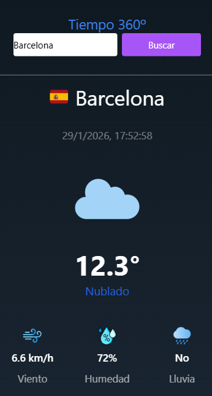

# 🌤️ El Tiempo 360º 🌦️



## Demo en vivo
[ElTiempo360](https://albertodeveloper94.github.io/ElTiempo360/)

## ⭐ Visión General ⭐
La app **El Tiempo 360º** esta inspirada en diseños minimalistas dónde el objetivo principal es transmitir la información de manera clara y concisa. El usuario puede consultar el tiemmpo actual, de la próximas horas y próximos dias, de cualquier ciudad del mundo.

Ha sido diseñada para que se vea únicamente bien en dispositivos móviles dónde, desde el principio, se ha pensado para una buena experiencia de usuario.

## 🗒️Características principales🗒️

- **🎨 Diseño Minimalista Mobile First**: El diseño está pensado para que se adapte únicamente a dispositivos móviles.

- **Información clara y concisa**: La información se entiende con claridad en cada apartado de la aplicación.

- **🏙️ Buscador de ciudad**: La aplicación tiene una funcionalidad que se basa en que el usuario puede consultar el tiempo actual, por horas y semanal de cualquier ciudad del mundo a través de un buscador. Por defecto, esta configurado para que muestre el clima de Barcelona.

- **Consumo de Api Open-Meteo**: Toda la información es extraída de la api Open-Meteo para poder imprimir por pantalla los datos en tiempo real.

## Stack utilizado
- **HTML5** para la estructura
- **Framework Taiwind CSS** para el estilo
- **Javascript** para la lógica
- **Git** para el control de versiones
- **IA Generativa (Stitch Google y ChatGpt)** Para una ayuda/asistencia

## Api Open-Meteo

[Api Open-Meteo](https://open-meteo.com/)

Parámetros utilizados:
- Latitude,longitude
- Current: Temperature_2m, relative_humidity_2m, wind_speed_10m, rain, weathercode
- Hourly: precipitation_probability,temperature_2m,weathercode
- Daily: temperature_2m_mean,weathercode

## Estructura del proyecto
```ElTiempo360/
│
├── assets/
│   └── icons/
│       ├── cloud.png
│       ├── cloudy_middle.png
│       ├── heavy-rain.png
│       ├── heavyDrizzle.png
│       ├── humidity.png
│       ├── light-rain.png
│       ├── lightDrizzle.png
│       ├── mediumDrizzle.png
│       ├── rain.png
│       ├── snow.png
│       ├── snowGrain.png
│       ├── storm.png
│       ├── sun.png
│       ├── unknown.png
│       └── wind.png
│
├── js/
│   ├── bannerHeight.js
│   ├── weatherApi.js
│   └── tailwind.config.js
│
├── index.html
└── README.md
```
## Uso de IA Generativa

### Stitch Google

He utilizado Stitch Google para ayudarme a generar un prototipo acorde al diseño que tenia pensado para empezar a trabajar.

### ChatGpt
Me ha ayudado en lo siguiente:

- Resolver errores de código y posibles bugs, tratando de entenderlo.
- Calcular las horas y los dias actualizados de las secciones por horas y por dias.
- Investigar y entender las dudas que tenía de la documentación de la api, para una mayor comprensión.
- Organizar mejor el código, sobretodo en Javascript.

Decir que, en todo momento, ha sido una ayuda/soporte para entender como hacer la aplicación, sobretodo en Javascript ( endpoints requeridos, calcular horas del dia y dias de la semana e imprimir por pantalla los resultados).

## Instalación
Sigue estos pasos para clonar y ejecutar el proyecto en tu máquina local.

```
git clone https://github.com/AlbertoDeveloper94/ElTiempo360.git

cd ElTiempo360

Open With Live Server en index.html
```
